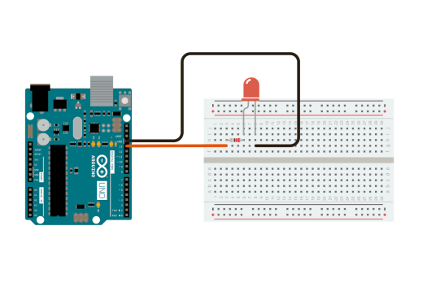

**Session 1: Introduction to Robotics and Arduino**
===================================================

## Session Requirements

hardware        | amount (per group)
--------        | ------
Arduino uno **or** ESP32     | 1
wire to program the boards   | 1
LED             | 1
1k ohm resistor | 1
bread board     | 1
jumper wire     | 2 (at least)


### What is a Robot?

A robot is an automated machine that can perform tasks that typically require human intelligence. It can be a physical device, a software program, or even a network of interconnected systems.

### Use Cases for Robots

Robots have numerous applications across various industries, including:

* **Manufacturing**: robots are used to improve efficiency and accuracy in production lines.
* **Healthcare**: robots assist medical professionals with surgery, patient care, and rehabilitation.
* **Security**: robots help maintain security by detecting intruders, monitoring surveillance cameras, and responding to emergencies.
* **Education**: robots teach students programming concepts, robotics engineering, and other STEM subjects.

### Essential Tools for Robotics

Some basic tools that are useful for robotics and tinkering include:

* **Multimeter**: measures voltage, current, and resistance in electronic circuits, useful for debug your board and hardware.
* **Power supply**: provides a stable power source for electronics
* **Oscilloscope**: electronic instrument that displays the waveform of electrical signals using a graphical representation on a screen
* **Breadboard**: a prototyping platform for building and testing electronic circuits
* **Jumper wires**: connect components together in a circuit and breadboards
* **Soldering iron**: joins two metal pieces together using solder

**Robot Brains**
=====================

When it comes to building robots, you need a "brain" to control and coordinate their movements. There are several options available:

* **Microcontrollers**: These small computers can read inputs from sensors, process information, and control outputs to devices.
* **Single-board computers**: More powerful boards that can run complex applications, such as the Raspberry Pi's.


for now We're going to focus on using **Arduino** as our primary microcontroller platform.
you can use **ESP32** if you want to, just be aware of the differences between these two boards.

**What is Arduino?**
-------------------

Arduino is a type of **microcontroller**, which means it's a small computer that can read inputs, process information, and control outputs. The benefits of using Arduino include:

* **Easy-to-use**: Simple programming interface with a large community of developers
* **Open-source**: Free to use, modify, and distribute
* **Low cost**: Affordable hardware and software solutions

### Getting Started with Arduino

for the first project we're going to control a simple LED. these are the components that are needed for this project:

* **USB cable**: connects your computer to the Arduino board
* **Breadboard**: a prototyping platform for building and testing electronic circuits
* **LED**: a light-emitting diode that blinks when connected to the Arduino board
* **Resistor**: regulates the flow of current in the circuit
* **PlatformIO IDE**: a free, open-source integrated development environment (IDE) for coding Arduino projects

**Hardware** 
-----------

simple image for connecting the led to arduino



* connect the anode of the led (positive, longer leg of led) to resistor and connect the resistor to one of the arduino Digital pin (13).
* connect the cathode (negative, shorter leg of led) to GND  of arduino.

**CODE**
--------
if you want complete code go [here](#complete-code).

```ARDUINO
#include <Arduino.h>

void setup(){
    // to setup pins, libraries, ...
    // only runs once at the startup of the board
}

void loop(){
    // runs in loop 
    // to set the pins, read from pins, run the motors, read from sensors
}

```

now first thing that we want to do is to tell which pins are we using and as what (INPUT or OUTPUT).

we do this by a function that is provided in Arduino called `pinMode(pinNum, pinMode)`.

usually we set the pin mode in `void setup()` function.

```Arduino
void setup(){
    // we want to control the led so we want to use the pin as OUTPUT
    pinMode(13, OUTPUT);
}
```

now that we determine the pin mode we want to control the led and blink every 1 seconds.

to write on pin we use `digitalWrite(pinNum, Val)` (the Val can be 0 as deactive and 1 as active also we can use `HIGH` or `LOW` as Val).

```Arduino
void loop(){
    digitalWrite(13, HIGH);
    // or digitalWrite(13, 1);
}
```

this code will turn on the LED but we want to turn it off and on every 1 second.

```Arduino
void loop(){
    digitalWrite(13, HIGH);
    // or digitalWrite(13, 1);

    digitalWrite(13, LOW);
    // or digitalWrite(13, 0);

}
```

in theory this code should turn on and off the LED. BUT the LED stays on.
thats because the code runs soo fast that you cant see the result. (you can show it with Oscilloscope)
so we have to make the the arduino stop for a bit so we can see the LED turn off or on.
we can make the arduino stop for specific time by function called `Delay(Amount)` the Amount is in milliseconds.

```Arduino
void loop(){
    digitalWrite(13, HIGH);
    // or digitalWrite(13, 1);

    Delay(1000);
    //one second ON

    digitalWrite(13, LOW);
    // or digitalWrite(13, 0);

    Delay(1000);
    //one second OFF
}
```
**Congrats** You've successfully uploaded and run your very first Arduino program :)

**Complete Code**
-----------------

```Arduino
#include <Arduino.h>

void setup(){
    // we want to control the led so we want to use the pin as OUTPUT
    pinMode(13, OUTPUT);
}

void loop(){
    digitalWrite(13, HIGH);
    // or digitalWrite(13, 1);

    Delay(1000);
    //one second ON

    digitalWrite(13, LOW);
    // or digitalWrite(13, 0);

    Delay(1000);
    //one second OFF
}

```

to compile and upload your code follow [this](../Utils/readme.md#how-to) instruction.