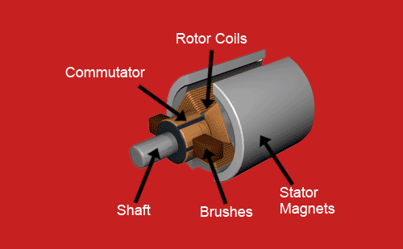
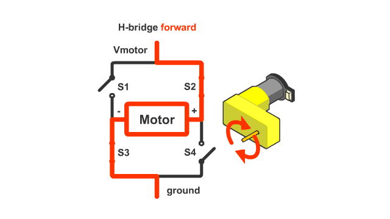
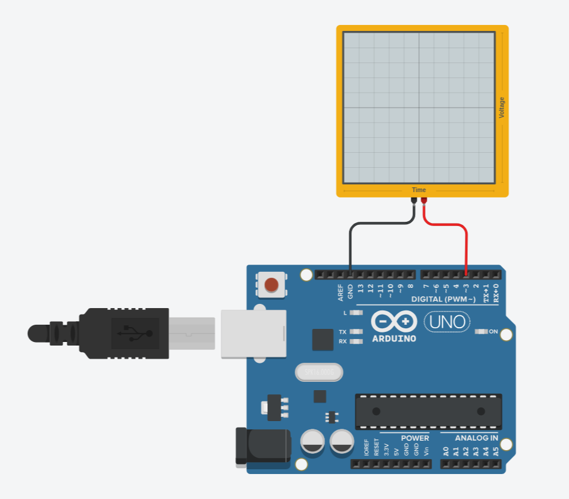
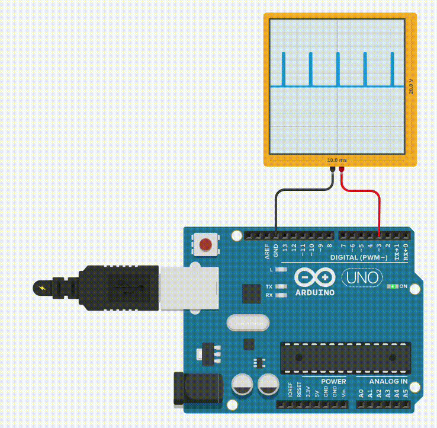

**Session 2: Motors and Drivers**
=================================
this session will be divided into 4 sections for different types of motors.

### Section 1: DC brushed motors

+ #### Section Requirements

    | Hardware                  | Amount (per group)    |
    | ------------------------- | --------------------- |
    | Arduino uno **or** ESP32  | 1                     |
    | wire for programming      | 1                     |
    | DC brushed motor          | 2                     |
    | L298N Driver              | 1                     |
    | 9v battery or power supply| 1                     |
    | wire                      | 14 (at least)         |
    
    ## what is DC Brushed motor:
    
    Brushed motors are the oldest type of DC motor (around since late the 1800’s) with origins that trace back to Michael Faraday, so we’ll take a look at them first.

    <div style="text-align: center;">

    

    </div>

    This type of DC motor consists of four main parts: 

    1. **Brushes:** Two brushes are mounted on either side of the commutator. These brushes make contact with the commutator segments, allowing current to flow between the motor's terminals.
    2. **Commutator:** A rotating ring with multiple metal segments that rotate in synchronization with the motor shaft. The commutator distributes electrical energy to the motor's windings.
    3. **Armature:** The moving part of the motor that contains the conductors (windings) and is attached to the shaft.
    4. **Stator:** The stationary part of the motor that consists of the magnetic field and is not connected to any conductive material.

    ### Operation:
    
    1. When a voltage is applied across the motor's terminals, current flows through the brushes and commutator into the armature windings.

    2. As the armature rotates with the shaft, the commutator segments come in contact with the brushes at specific intervals, allowing current to flow through the windings.

    3. The interaction between the magnetic field of the stator and the current-carrying armature causes the motor to rotate.

    4. When the brushes switch from one winding to another (a process called "commutation"), they ensure that the current is transferred without interruption.

    ### Advantages:
    
    1. Relatively simple design.
    2. Easy to manufacture and maintain.
    3. Low cost.

    ### Disadvantages:
    
    1. Brushes can wear out over time, requiring replacement

    2. Efficiency is relatively low compared to other motor types (e.g., brushless DC motors)

    3. Can produce electromagnetic interference (EMI)

    ### Usage:
    
    We want to use a DC brushed motor in our projects, but we need to control two aspects: speed and direction. To achieve this, we can utilize two features of these motors: 

    <br /> 1. Direction Control: By changing the polarity of the motor (i.e., reversing the voltage), we can change the direction of the motor.

    <br /> 2. Speed Control: By adjusting the voltage provided to the motor, we can change its speed.


    #### Important Safety Note:


    When controlling a DC brushed motor, it's essential to be aware that applying too high a voltage can cause the windings inside the armature to overheat and melt, resulting in permanent damage to the motor. **Always check the recommended maximum voltage for your motor**, as exceeding this limit can lead to catastrophic failure.


    <br /> To automate speed and direction control, we need electronic components that can interface with our microcontroller's I/O pins. These components will enable us to program the motor's behavior using our microcontroller's programming language.

    ### H-Bridge Circuit and PWM for Controlling Motor Speed and Direction:

    To efficiently and safely control a DC brushed motor's speed and direction, we can use an H-bridge circuit in conjunction with Pulse Width Modulation (PWM) signals. Here's how it works:

    #### What is an H-Bridge?

    An H-bridge is an electronic circuit that consists of four power transistors arranged in the shape of an "H". It allows us to control the flow of current to the motor by switching on and off different combinations of transistors.

    ##### How does an H-Bridge work?
    
    The H-bridge circuit has two pairs of transistors:

    1. **Upper Left and Upper Right Transistors:** These transistors connect to the positive voltage source (V+) and control the flow of current from V+ to the motor.

    2. **Lower Left and Lower Right Transistors:** These transistors connect to ground and control the flow of current from the motor back to ground.

    <div style="text-align: center;">

    

    </div>

    <br />By switching on different combinations of these transistors, we can:


    + Reverse the direction of the motor by changing which pair of transistors is switched on.

    + Control the speed of the motor by adjusting the duty cycle (on/off ratio) of the PWM signal applied to the transistor that is used as a voltage source of our H-bridge circuit.

    ##### What is Pulse Width Modulation (PWM)?

    PWM is a technique used to control the average voltage supplied to an electronic device, in this case, the DC brushed motor. A PWM signal consists of a high-frequency square wave with varying duty cycles.


    <br />The duty cycle is the ratio of the "on" time to the total period of the waveform. By adjusting the duty cycle, we can change the effective voltage applied to the motor and control its speed.

    <div style="text-align: center;">

    $$ DutyCycle = on/(on+off) $$

    </div>

    <div style="text-align: center;">

    <br />

    </div>

    the pwm signal is provided by our microcontroller and each microcontroller has specific pins as a pwm enable pins for example the Arduino uno has `~` mark on a side of the pin number for the pins that are pwm enable, **check the datasheet of your microcontroller's or search for the pinout of your board to find which pins are pwm enable.**  

    to write a pwm signal on the pin we use `analogWrite(pinNum, val);` command, the `val` is an 8bit number between 0 and 255, you can calculate the duty cycle with this equation:
    
<div style="text-align: center;">

$$ DutyCycle = (val \times 100)/255 $$

</div>

<details>
<summary>Show PWM signal on Oscilloscope</summary>

**If You don't know how to work with Oscilloscope and what is it in general watch [this video](https://www.youtube.com/watch?v=DgYGRtkd9Vs).**

to show the pwm signal on oscilloscope connect the tip of the probe (positive part of the probe) to the pwm pin of your board then connect the scope ground (negative part of the probe) to ground of your board `GND`.

</div>

<div style="text-align: center;">

<br />

</div>

## Code

now to show the pwm signal we must write a simple code.

```ARDUINO
#include <Arduino.h>

void setup(){
    // leave empty.
    // you don't need to set the pwm pin as output because the analogWrite function do that as well.
}

void loop(){

    for (int i=0; i<255; i+=5){
        analogWrite(3,i);
        delay(100);
    }

    for (int i=255; i>0; i-=5){
        analogWrite(3,i);
        delay(100);
    }
}
```

after uploading the code to the board you should see something like this on the Oscilloscope:

</div>

<div style="text-align: center;">

<br />

</div>

</details>