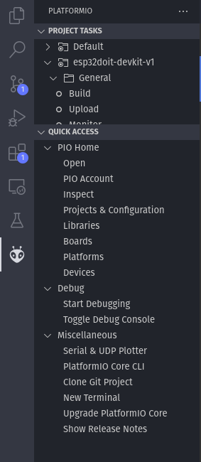
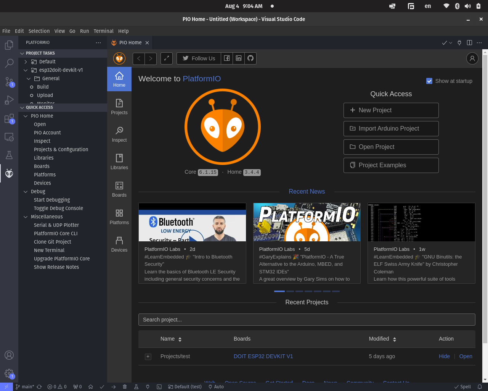
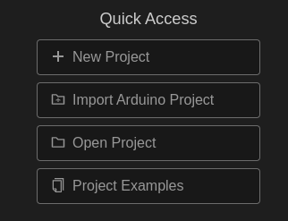
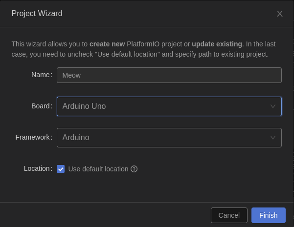

# All the installation guide and problems
-----------------------------------------
## Installation and Problems

<details>
<summary>VSCode</summary>

* download and install the vscode from [link](https://code.visualstudio.com/Download) (choose based on your operating system)

</details>

<details>
<summary>PlatformIO</summary>

### Install

* **for installing the platformIO you must first install the [VSCode](https://code.visualstudio.com/Download) and [Pyhton](https://www.python.org/downloads/) on your system**

* head to the extensions tab of your VScode (this icon  on the left bar **OR** go to **File > Preferences > Extensions**)
* Now search for **PlatformIO** and install the extension with this  logo.
* **It might ask you to install more extensions just accept**.
* It might take a while to install **Don't worry and be patient**

### HOW TO
<details>
<summary>Create a Project</summary>

* first check if  icon is on left bar of vscode or not.

* when you click on it the **Project Tasks** and **Quick Access** tabs will open if nothing shows up an it telling you **Initializing platformio core...** just give it time.



* in Quick access tab open **PIO Home** and select **Open**

* when you click open a page like this will show up.



* in quick access select the **New Project**



* give your project a name 

* select the board that you want to program (in our case it was Arduino Uno and DOIT ESP32 DEVKIT V1)

* select the framework to be **Arduino**

* then click finish.



* **It might take a while**

* when the project is created it will redirect you to Explorer tab

* and there are some folders in the project folder **Don't worry about theme** we only work with **src** directory and **platformio.ini** file **But Don't Delete the others**.

</details>

<details>
<summary>Compile and Upload your code</summary>

* when you install the platformIO it will add some icons on the **status bar** of vsCode (the bottom bar) that looks like these:


1. **Home Icon:** Open the platformIO Home.

2. **Check Icon:** build and compile your project.

3. **Arrow Icon:** build and upload your project to board.

4. **Trash can:** clean your board (delete the codes).

5. **Erlenmeyer Icon:** for test.

6. **Plug Icon:** Serial monitor from board.

7. **Terminal Icon:** Open New Terminal.

8. **Folder Icon:** If you have multiple platformIO project open in your workspace and want to change between them.

9. **Plug Icon:** Change the port that your board is connected.


</details>

### Problems

* **I've download and installed python but it says that there is no python installed what should i do?**
    - if your on windows add the pyhton path to path environment variables (for more help visit this [link](https://www.geeksforgeeks.org/how-to-add-python-to-windows-path/))

    - if you're using linux just install 
    python3-venv with this command :
    
    ```sh
    sudo apt install python3-venv
    ```
    - then just restart the vscode and install the platformIO.

* **I can't upload my project to my board**
    <details>
    <summary>make sure that your board is connected properly and your uploading to the correct port</summary>

    TODO

    </details>


    <details>
    <summary>make sure that you have the correct drivers on your computer</summary>

    TODO

    </details>

    - if your on linux and you get an error like this.
    ```sh
    A fatal error occurred: Could not open /path/to/port, the port doesn't exist
    ```
    - it means that you haven't give the permission to read or write on this port 
    
    - write this in your terminal, and try again.

    ```sh
    sudo chmod 777 /path/to/port
    ```


</details>